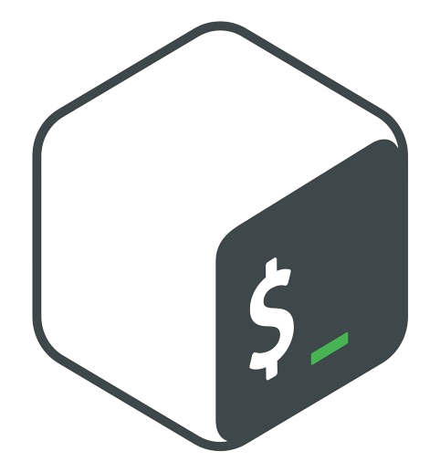

<h1 align="center">Hi 👋, I'm Shashank Rajora</h1>
<h3 align="center">C/C++, interested in low level stuff.</h3>

- 🔭 I’m currently working on [Operating Systems](https://github.com/Sha-x2-nk/ArjunOS)

- 🌱 I’m currently learning **Operating Systems**

- 👯 I’m looking to collaborate on [numC++](https://github.com/Sha-x2-nk/numCpp)

- 👨‍💻 All of my projects are available at [https://github.com/Sha-x2-nk](https://github.com/Sha-x2-nk)

- 💬 Ask me about **parallel programming, CUDA, ONNX RT, Deep Learning**

- 📫 How to reach me **shashankrajora2002@gmail.com**

- 📄 Know about my experiences [Resume_Shashank.pdf](https://drive.google.com/file/d/1K8m9XAa8W3EotS8VLB2nCJNyVWjcxJQa/view?usp=sharing)

- ⚡ Fun fact **लोहा  का
, जूता  का, छोरा  का**

<h3 align="left">Connect with me:</h3>

<h3 align="left">Languages and Tools:</h3>

                    

  
  

  

###
